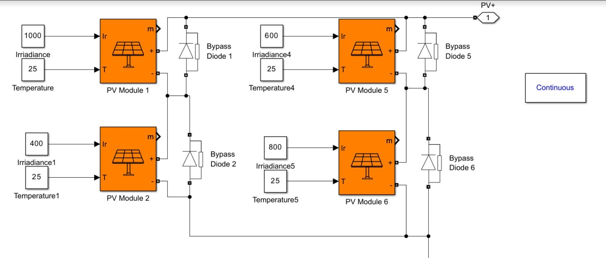

---

# **Effect of Irradiance, Temperature, and Partial Shading on Solar PV Outputs**

## **Overview**
This repository analyzes the behavior of a **Photovoltaic (PV) system** under varying conditions of **irradiance**, **temperature**, and **partial shading**. The study focuses on observing the impact on the **I-V (Current-Voltage)** and **P-V (Power-Voltage)** characteristics of the PV system.

The simulation models were designed in **Simulink** and consist of:

1. **Single PV Cell Setup**
2. **PV Array Setup with Partial Shading**

---

## **1. Single PV Cell Setup**


### **PV Cell with Varying Irradiance and Temperature**
The first model simulates a single PV module with adjustable **irradiance** and **temperature** inputs. It helps in understanding how the module’s output changes with respect to these environmental variables.

#### **Key Features**:
- **Irradiance Values**: Input irradiance levels of **1000 W/m²**, **400 W/m²**, **600 W/m²**, and **800 W/m²**.
- **Temperature Values**: Fixed temperature of **25°C** across simulations to isolate irradiance effects.

#### **Output Graphs**:
- **I-V Plots**: Showcasing the relationship between current and voltage.
- **P-V Plots**: Highlighting the power output as voltage changes.


---

## **2. PV Array with Partial Shading**

### **Array Configuration**
The second model simulates a **PV array** consisting of multiple modules, where some modules experience **partial shading**. The irradiance and temperature for each module can be varied to simulate real-world conditions.

  
<br>



#### **Key Features**:
- **Irradiance Distribution**: Modules in the array receive irradiance levels of **1000 W/m²**, **400 W/m²**, **600 W/m²**, and **800 W/m²**.(values may vary according to user choice)
- **Partial Shading Impact**: Demonstrates how shading some modules reduces the array’s output, observable in the I-V and P-V plots.

#### **Output Graphs**:
- **I-V Plot**: Shows the collective current-voltage characteristics of the entire array.
- **P-V Plot**: Displays the total power output of the array.


---

## **Installation and Usage**

To run the simulations in this repository:

1. Ensure you have **MATLAB Simulink** installed with the required **Simscape Electrical** library.
2. Clone the repository:
   ```bash
   git clone https://github.com/your-username/Solar-PV.git
   ```
3. Open the Simulink models:
   - `exp2.slx` for single PV module simulations.
   - `exp3_partialshading.slx` for partial shading simulations.
4. Run the simulation and observe the output plots for **I-V** and **P-V** characteristics.

---

## **Applications**

Understanding the behavior of **PV modules** under varying environmental conditions is crucial for designing robust **solar power systems**. This study helps to:

- **Optimize PV system performance** by analyzing how temperature and irradiance impact power output.
- **Mitigate power losses** in solar arrays caused by partial shading.
- Develop strategies to **enhance array performance** using **bypass diodes**.

